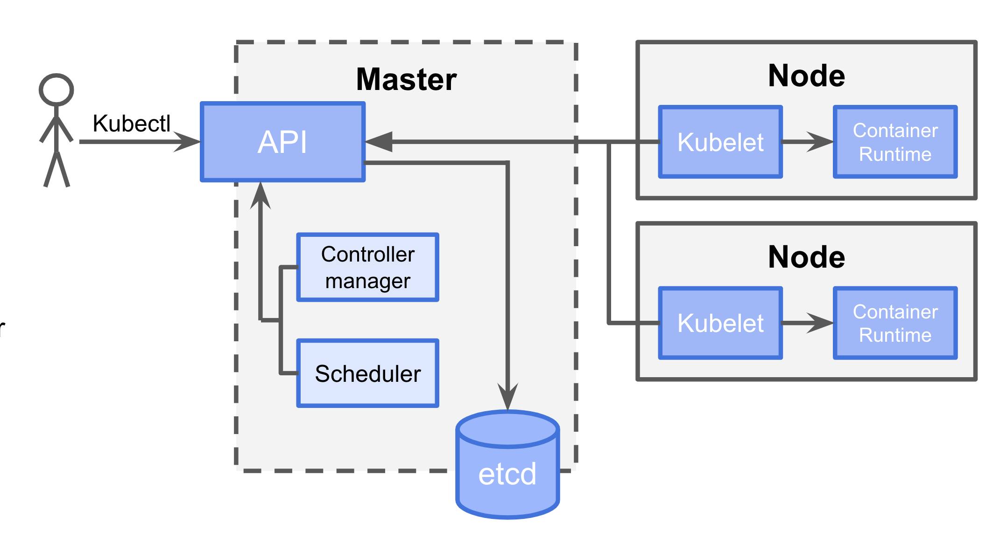
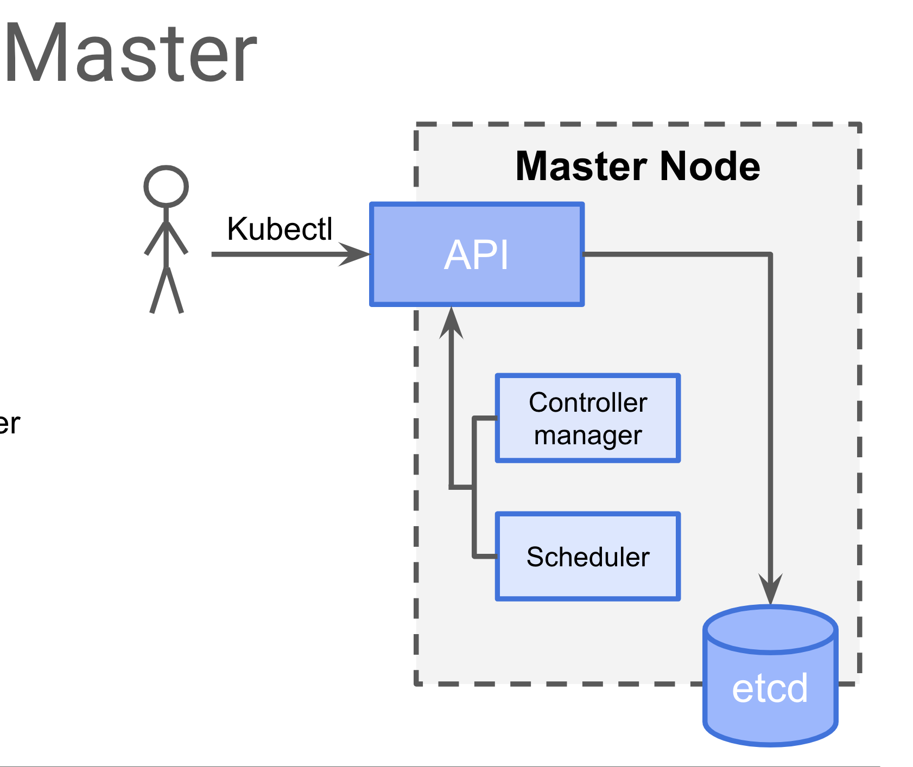
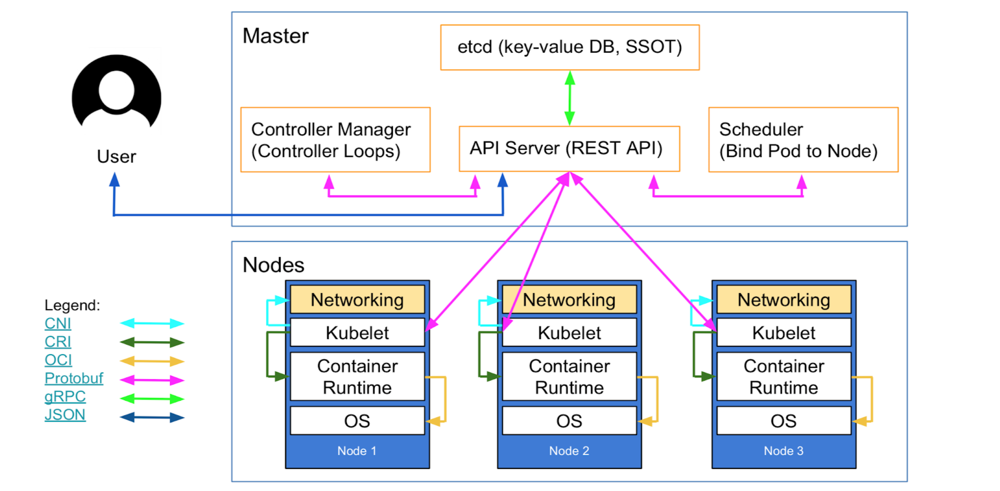

+++
title = "Architecture"
date = 2018-12-09T17:00:54-05:00
weight = 20

+++

## [High level Architecture](https://kubernetes.io/docs/concepts/architecture/)

* User:
  * Kubectl (CLI tool)
  * UI: Dashboard
* Master:
  * API Server
  * Etcd
  * Scheduler
  * Controller Manager
* Nodes:
  * Kubelet
  * Container Runtime

___

## Master

* API data store: Etcd (Cluster State)

* Controller Manager :
  * Node Controller
  * Deployment Controller
  * ReplicaSet Controller
  * Replication Controller
  * Endpoints Controller
  * Service Account & Token Controller
  
* Scheduler: Bind pod to Node

___

## Node

Kubelet:
  * cAdvisor (metrics, logs...)

Container Runtime:
  * docker
  * containerd

Pod:
  * Container (one or more)

Kube-proxy:
  * Used to reach services and allow communication between Nodes.

___

## Data Flow

* CNI: Network Plugin in Kubelet that allows to talk to networking to get IPs for Pods and Services.

* gRPC: API to communicate API Server to ETCD, Controller Manager and Scheduler

* Kubelet - all K8s nodes have a kubelet that ensures that any pod assigned to it are running and configured in the desired state.

* CRI(Container Runtime Interface) gRPC API compiled in kubelet which allows to kubelet to talk to container runtimes by using gRPC API.

* The Container Runtime provider has to adapt it to CRI API to allow kubelet to talk to them by using OCI Standard (runc)
Initially, Kubernetes was built on top of Docker as the container runtime. Soon after, CoreOS announced the rkt container runtime and wanted Kubernetes to support it, as well. So, Kubernetes ended up supporting Docker and rkt, although this model wasn't very scalable in terms of adding new features or support for new container runtimes.

* CRI consists of a protocol buffers and gRPC API, and libraries,

